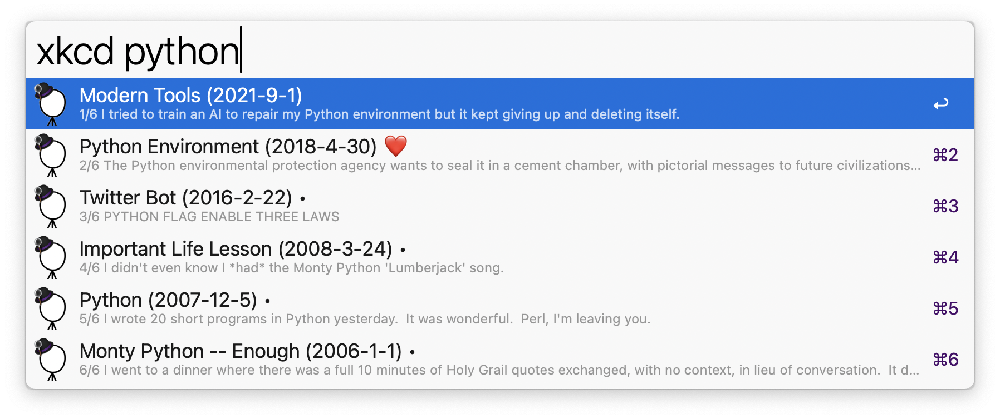

# alfred-xkcd
A browser for xkcd comics

If you are an xkcd fan and have ever tried to remember or find a particular comic, you might find this Workfklow helpful. 

# Usage
- Search (default keyword: `xkcd`) or hotkey: list and search xkcd comics. `❤️` will denote favorite, `•` unread comics. 
- Favorite (default keyword: `xk::favs`) or hotkey: favorite xkcd comics in grid view. 
- Random (default keyword: `xk::random`) or hotkey: one random unread xkcd comic. 
- Recent (default keyword: `xk::recent`) or hotkey: recently viewed xkcd comics in grid view. 
 

## While in list, random, or favorite view:
- `↩️` show in text view (comic will be marked as read)
-  `⇧↩️`: copy comic image to clipboard
-  `⇧` (QuickLook): QuickLook image (`⇧` or `space` to quit). Using the arrow keys you can quickly review multiple comics (will not be marked as read)
-  `^↩️`: toggle favorite status
-  `⌘↩️`: open on `xkcd.com`
-  `⌥↩️`: open on `explainxkcd.com` (which has also larger images)

# Updating
- `alfred-xkcd` will download the titles of new comics based on the number of days specified in the `Workflow Configuration` (Refresh Rate variable)
- refresh can be forced with `xk::refresh`

 

# Feedback
... is welcome!
https://github.com/giovannicoppola/alfred-xkcd/issues
