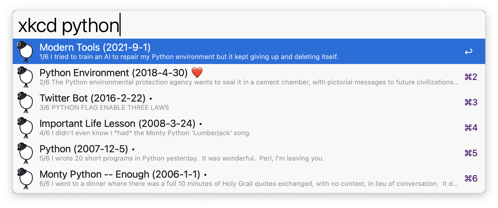

# alfred-xkcd

A browser for xkcd comics

If you are an xkcd fan and have ever tried to remember or find a particular comic, you might find this Workflow helpful.

<a href="https://github.com/giovannicoppola/alfred-xkcd/releases/latest/">
 
</a>

# Usage

- Search (default keyword: `xxkcd`) or hotkey: list and search xkcd comics. `❤️` will denote favorite, `•` unread comics.
- Favorite (default keyword: `xxk::favs`) or hotkey: favorite xkcd comics in grid view.
- Random (default keyword: `xxk::random`) or hotkey: one random unread xkcd comic. Press enter for more!
- Recent (default keyword: `xxk::recent`) or hotkey: recently viewed xkcd comics in grid view.

## On a selected comic:

- <kbd>↩️</kbd> show (comic will be marked as read)
- <kbd>⇧</kbd><kbd>↩️</kbd>: copy comic image to clipboard
- <kbd>⇧</kbd> (QuickLook): QuickLook image (`⇧` or `space` to quit). Using the arrow keys you can quickly review multiple comics (will not be marked as read)
- <kbd>^</kbd><kbd>↩️</kbd>: toggle favorite status
- <kbd>⌘</kbd><kbd>↩️</kbd>: open on `xkcd.com`
- <kbd>⌥</kbd><kbd>↩️</kbd>: open on `explainxkcd.com` (which has also larger images)

# Updating

- `alfred-xkcd` will download the titles of new comics based on the number of days specified in the `Workflow Configuration` (Refresh Rate variable)
- refresh can be forced with `xxk::refresh`

# Acknowledgements

- [xkcd](https://xkcd.com/) for the comics
- [explainxkcd](https://explainxkcd.com/) for the explanations
- [Alfred](https://www.alfredapp.com/) for the workflow
- [Cursor AI](https://cursor.com/) for help with coding and documentation
- [ChatGPT](https://chat.openai.com/) for help with the icon

# Feedback

... is welcome!
https://github.com/giovannicoppola/alfred-xkcd/issues

# Changelog

- 2025-07-17 version 1.0, improved and rewritten in go
- 2024-07-21 version 0.2 added search by comic #ID
- 2024-07-21 version 0.1
